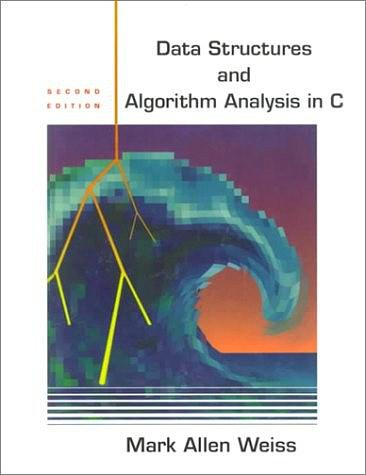

## 数据结构与算法

>环境：MacOS && CLion 2021
>
>作者：陈翰杰

***

我使用的教材是下面这本书的翻译版，也就是大黑书。



***

#### Part1: 在这里说明一下文件夹的命名

```c
DataStruct_章节号
```

#### 然后说明一下每个文件夹包含的文件 包含5种类型

```c
main.c				       --用于记录开启每章的时间和自己的一些想法
Book_序号.c			       --本章中书中的代码 注意和书中的顺序可能不同
Practice_序号.c		      	       --本章课后练习题
CMakeLists.txt			       --CLion的编译文件 因为需要编译多个main函数
```

